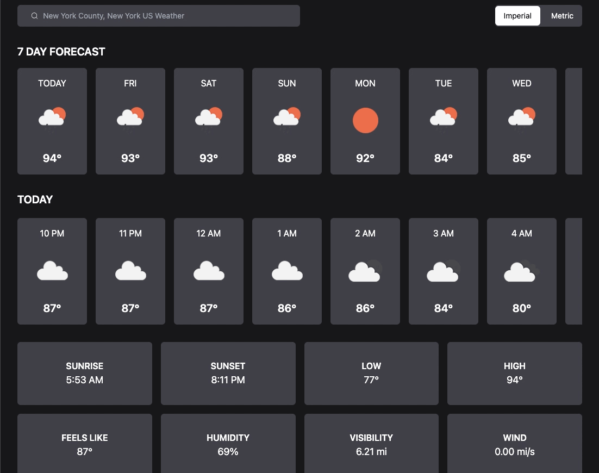
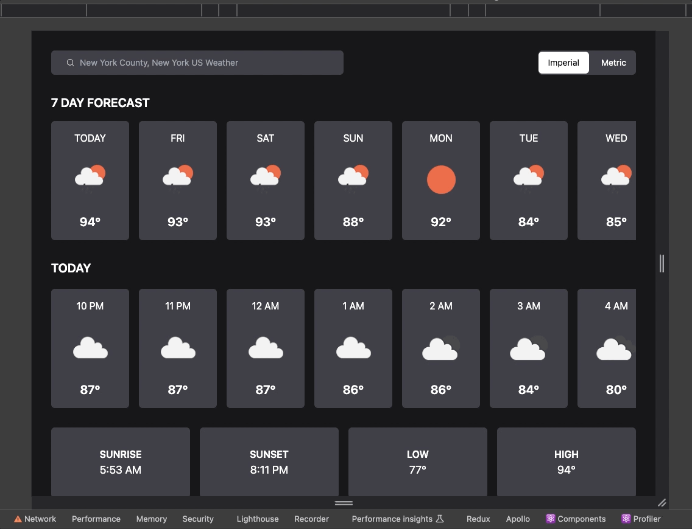
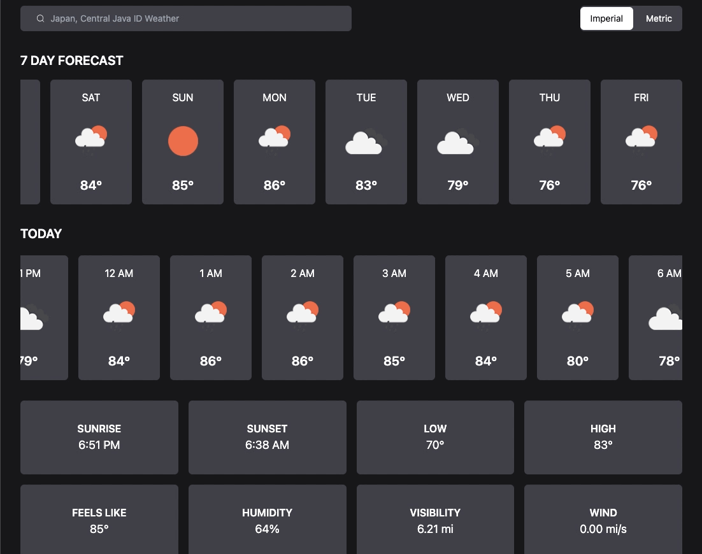
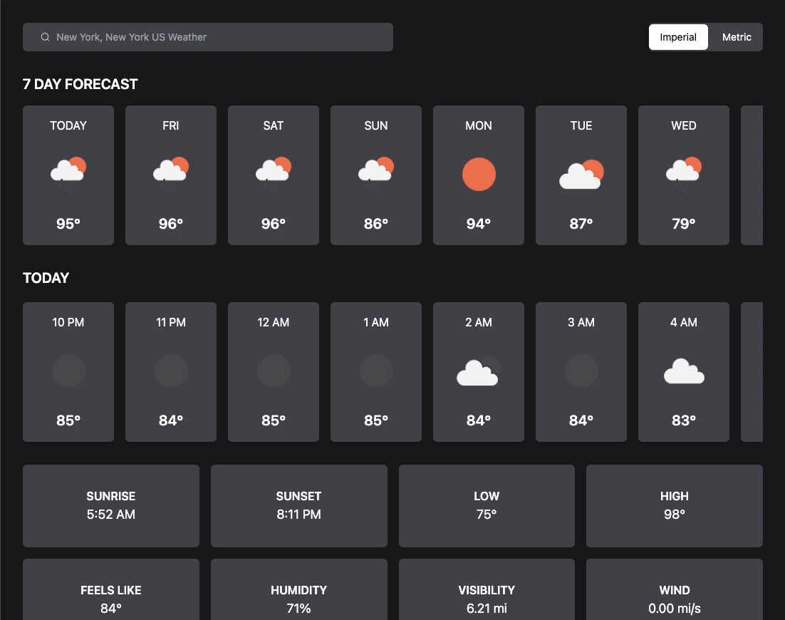

    

## Overview

This is a responsive Weather App. It utilizes the OpenWeather API to provide hourly and daily
forcast for either a specified city or the user's current location. It supports both metric and imperial units.

## Technology

-   
-   

## Features

The app adapts beautifully to any screen size, ensuring a smooth experience on desktops, tablets, and mobile devices.

    

Get your current location's weather with a single click, letting you know what to expect right outside your window

    

Easily find weather information for any city in the world by simply entering its name.

    

Switch between metric and imperial units to display weather data in the format that best suits your needs.

    

